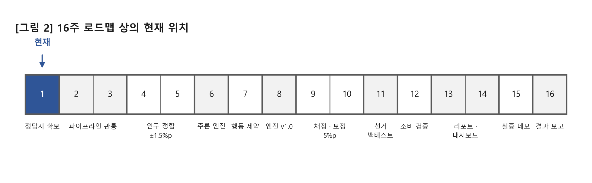
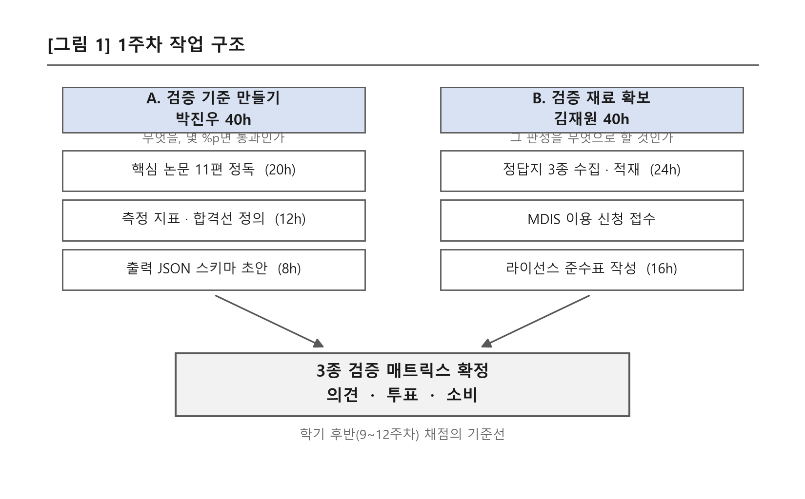
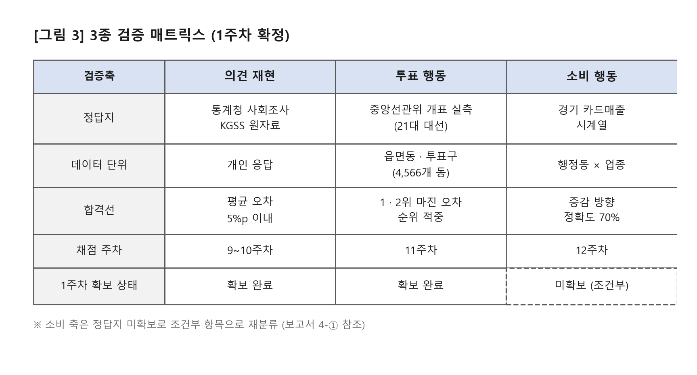

# 드림학기제 주차별 보고서 — 1주차

| 항목 | 내용 |
|---|---|
| 프로젝트명 | IDEA(이데아) — 공공데이터 기반 AI 합성 인구 행동 시뮬레이션 엔진 |
| 기간 | 2026-08-31(월) ~ 2026-09-06(일) |
| 팀원 | 박진우 40h / 김재원 40h |



---

## 1. 프로젝트 주차 목표

16주 전체 계획을 확정하고, 학기 후반 검증에 쓸 '정답지' 실측 데이터를 미리 모두 확보한다.
(후반에 데이터가 없어 검증을 못 하는 사태를 원천 차단)

### 상세 목표

- 합성 인구·실리콘 샘플링·LLM 에이전트 관련 핵심 논문 5~7편 정독, 엔진과 검증의 이론적 근거 정리
- 검증용 정답지 수집: 중앙선관위 개표 실측(읍면동 단위), 통계청 사회조사·KGSS 원자료, 경기 카드매출 시계열
- 통계청 마이크로데이터(MDIS) 이용 신청서 제출 — 승인에 1~2주 걸리므로 이번 주 안에 반드시 접수 (4주차 인구 정합에 필요)
- 수집한 데이터별 이용약관·라이선스(상업적 이용·재가공·결과 배포 가능 범위)를 표로 정리

### 팀원별 목표 및 투입시간

| 팀원 | 목표 및 활동 | 투입시간 |
|---|---|---|
| 박진우 | 핵심 논문 정독·엔진/검증 설계 밑그림 20h + 3종 검증의 측정 지표·합격선 정의 12h + 시뮬레이션 출력 JSON 스키마 초안 8h | 40h |
| 김재원 | 정답지 데이터 수집·DB 적재·스키마 설계 24h + [독립] 데이터 명세서·라이선스 준수표 문서화 16h | 40h |

---

## 2. 프로젝트 주차 진행 내용



이번 주 작업은 두 축으로 나누어 병렬 진행하였다.
A축은 "무엇을, 몇 %p면 통과라고 할 것인가"라는 판정 기준을 만드는 쪽이고,
B축은 "그 판정을 무엇으로 할 것인가"라는 채점 재료를 확보하는 쪽이다.
두 축은 주 후반에 3종 검증 매트릭스로 합류시켰다.

### A-1. 핵심 논문 정독 및 이론적 근거 정리 (박진우 22h)

계획한 5~7편보다 확대하여 총 11편을 정독하였다. 단순히 읽는 데 그치지 않기 위해, 논문 한 편마다 "이 논문이 우리 어느 모듈의 근거가 되는가"를 1:1로 대응시키는 방식으로 정리하였다.

**방법론 계열 — "무엇을 만들 것인가"의 선례**

| # | 논문 · 저자 · 연도 | 게재 | 우리 설계에 반영한 항목 |
|:--:|---|---|---|
| 1 | Random Silicon Sampling — Sun et al. (2024) | arXiv:2402.18144 (프리프린트) | 개인 프로필 없이 집단 인구통계 분포만으로 하위집단 여론을 시뮬레이션하는 방식 — 우리 합성 인구 샘플링의 기본 골격 |
| 2 | SPIRIT: Persona-Based Simulation of Human Opinion at Population Scale — Li & Conrad (2026) | arXiv:2603.27056 (프리프린트) | 인구통계만 쓰는 대신 가치·삶의 경험까지 담은 반구조화 페르소나. 인구통계-only 대비 개인 응답 복원 정확도 8~9%p 개선 보고 → 페르소나 뱅크를 '가상 응답자 패널'로 운영하는 개념을 제품 아키텍처의 참조 모델로 채택 |
| 3 | PolyPersona — Dash et al. (2025) | arXiv:2512.14562 · IEEE BigData 2025 LLMs4ALL 워크숍 (동료심사) | 프롬프팅이 아니라 파인튜닝으로 페르소나 응답을 합성하는 경로 — 우리가 택하지 않은 대안을 비교 기준으로 확보 |
| 4 | ElectionSim (2024) | arXiv:2410.20746 (프리프린트) | 소셜미디어에서 100만 명 규모 유권자 에이전트 풀을 구축한 사례. 선거 재현 채점 프레임(득표율 오차·순위 적중)과 인구통계 분포 정렬 샘플링 전략을 11주차 백테스트 설계에 반영 |

**한계·편향 계열 — "무엇을 피해야 하는가"의 증거**

| # | 논문 · 저자 · 연도 | 게재 | 우리 설계에 반영한 항목 |
|:--:|---|---|---|
| 5 | Mitigating Social Desirability Bias in Random Silicon Sampling (2025) | arXiv:2512.22725 (프리프린트) | 민감 질문에서 AI가 사회적으로 바람직한 답으로 치우치는 현상 확인. 4가지 개입 중 중립적·3인칭 표현으로의 최소 재구성만 유효했고 프라이밍·프리앰블은 효과 없음 → 확신도 필드와 '판단 보류' 규칙(6주차)의 직접 근거 |
| 6 | Persona Conditioning Reliability for Survey Simulation — Taday Morocho et al. (2026) | arXiv:2602.18462 · ACM Web Conference 2026 Companion (동료심사, DOI 10.1145/3774905.3795477) | 8개 사회인구학적 속성으로 페르소나를 조건화해도 집계 정합이 개선되지 않고 다수 경우 오히려 저하 — 오차를 재분배할 뿐. **"인구가 맞는 것 ≠ 응답이 맞는 것"** — 4~5주차 인구 정합 ±1.5%p를 달성해도 정확도를 보장하지 않는다는 한계 인식의 근거 |
| 7 | Human Preferences in LLM Latent Space — Ball et al. (2025) | arXiv:2502.16280 · AAPOR 2025 발표 | 14개 LLM 프로브 분석. 합성 응답이 실제 인간 응답의 분산을 재현하지 못하고, 정치 영역에서 페르소나-정당 매핑의 변별이 제한됨 → 채점 지표에 '분산 보존'을 별도 항목으로 넣은 직접 근거 |

**기보유 배경 문헌 4편**

| # | 논문 | 우리 설계에 반영한 항목 |
|:--:|---|---|
| 8 | Integrating LLM in Agent-Based Social Simulation | 에이전트 기반 사회 시뮬레이션의 일반 구조 |
| 9 | On the Eligibility of LLMs for Counterfactual Reasoning: A Decompositional Study | "만약 이 정책을 시행하면"류 반사실 추론의 적격성 한계 — 조건 민감도 실험 설계의 전제 |
| 10 | What Limits LLM-based Human Simulation | 시뮬레이션이 원리적으로 못 하는 영역의 사전 정리 |
| 11 | Why Do Multi-Agent LLM Systems Fail | 다중 에이전트 구조를 채택하지 않기로 한 근거 |

**정독 결과 도출한 3가지 판단**

1. **인용 시 프리프린트 여부 명시** — 11편 중 확정 동료심사는 2편([3] IEEE BigData 워크숍, [6] WWW'26 Companion)뿐이다.
2. **인용 금지 목록 2건 작성** — [1]의 "미국 여론조사 결과와 근접 일치"(GPT-3.5 시대·미국 ANES 한정)와 [3]의 "소형 모델이 7~8B급 성능"(텍스트 생성 지표만 평가) 주장은 우리 보고서·발표에서 근거로 쓰지 않기로 사전에 못 박았다.
3. **한국 검증 선례 부재 확인** — 검증한 논문 전부가 미국 데이터(ANES·WVS-US·KnowledgePanel·영어 소셜미디어) 기반이다. 한국어 LLM + 한국 인구 대상 검증 연구는 확인되지 않았고, 이 공백 자체가 우리 프로젝트의 차별점이 된다.

### A-2. 측정 지표 및 합격선 정의 (박진우 11h)

이 프로젝트는 "잘 맞았다"가 아니라 **"어디서 얼마나 틀렸는지"를 공개하는 것**이 제품의 핵심이다. 따라서 성능을 본 뒤에 기준을 옮기는 일이 생기지 않도록, 채점 지표와 합격선을 학기 시작 시점에 고정하였다.

**주차별 통과 기준**

| 주차 | 검증 항목 | 합격선 |
|---|---|---|
| 4~5주차 | 인구 정합 | 주요 인구 마진 ±1.5%p 이내, 시도별 최소 표본 200명 |
| 9~10주차 | 의견 재현 | 평균 오차 5%p 이내 (단, 보정에 사용하지 않은 문항으로만 채점) |
| 11주차 | 투표 재현 | 1·2위 후보 마진 오차 및 순위 적중 여부 |
| 12주차 | 소비 재현 | 증감 방향 정확도 70% 이상 |

**평균 오차(MAE) 하나로 채점하지 않는 이유 — 부속 지표 5종**

| 지표 | 이 지표가 잡아내는 것 |
|---|---|
| 1·2위 마진 오차 | 평균 오차가 작아도 순위가 뒤집히면 예측으로서 실패 |
| 항목별 최대 오차 | 평균 뒤에 숨은 국소적 큰 오차를 드러냄 |
| 소수 선택지 재현율 | 군소 후보·소수 의견이 0%로 붕괴하는 현상을 감시 |
| 분산 보존 | 응답이 평균값으로 뭉개졌는지 확인 (분포를 파는 제품이므로 이 붕괴는 치명적. 근거 [7]) |
| 하위집단 오차 | 전국 합계는 맞는데 특정 연령·지역만 크게 틀리는 경우를 적발 (근거 [6]) |

### A-3. 시뮬레이션 출력 JSON 스키마 초안 (박진우 7h)

모든 응답이 예외 없이 세 필드를 갖도록 표준화하였다. 3주차 end-to-end 관통에서 그대로 사용할 형태이다.

```json
{
  "persona_id" : "KR-0001",
  "question_id": "Q-001",
  "choice"     : "찬성",
  "reason"     : "월세 부담이 커서 ...",
  "confidence" : 0.72
}
```

| 필드 | 필수로 둔 이유 |
|---|---|
| `reason` (판단 근거) | 결과만 남기면 "왜 이런 결과가 나왔는지"를 되짚을 수 없어, 근거를 공개하는 검증형 예측이라는 제품 성격 자체가 성립하지 않는다 |
| `confidence` (확신도 0~1) | 확신도가 낮은 응답을 '판단 보류'로 분류하기 위한 것으로, 실제 조사의 무응답·유보층에 대응한다 (근거 [5]) |

### B-1. 검증용 정답지 수집 및 적재 (김재원 26h)

| 검증축 | 정답지 | 규모 · 커버리지 | 상태 |
|---|---|---|---|
| 의견 | 통계청 사회조사 / KGSS 원자료 | 개인 응답 단위 | 확보 완료 |
| 투표 | 중앙선관위 21대 대선 개표 실측 | 169,749행 / 17개 시도 · 231개 구시군 · 4,566개 읍면동, 후보 5인 | 확보 완료 |
| 소비 | 경기 카드매출 시계열 | 행정동 × 업종 단위 | **미확보** (4-① 참조) |

- 수집한 파일은 원자료 폴더에 그냥 두지 않고 **데이터 레지스트리**에 등록하였다. 파일마다 sha256 해시를 기록해 두어, 이후 어떤 채점을 하든 "그때 그 파일"을 참조했음을 증명할 수 있게 하였다.
- 지역 결합은 지역명 문자열이 아니라 **행정표준코드** 기준으로 하기로 규칙을 정하였다. ('중구'처럼 이름이 겹치는 지역이 여럿이라 문자열 결합은 오류를 낸다.)

### B-2. 통계청 마이크로데이터(MDIS) 이용 신청 접수 (김재원)

4주차 인구 정합에 필요한 MDIS 이용 신청을 이번 주 내에 접수 완료하였다. 승인 소요가 1~2주이므로 4주차 착수 시점과 겹칠 수 있어, 대기 중에 일정이 멈추지 않도록 2단 경로를 미리 확정해 두었다.

| 분기 | 경로 |
|---|---|
| 승인 정상 | MDIS 마이크로데이터로 바로 인구 정합 |
| 승인 지연 | KOSIS 집계통계로 먼저 진행 → 승인 후 마이크로데이터로 정밀화 |

### B-3. 데이터 명세서 및 라이선스 준수표 v1 (김재원 14h, 독립 수행)

수집·사용 예정 데이터 전부에 대해 상업적 이용·재가공·결과 배포 가능 범위를 표로 정리하였다. 창업형 과제이므로 "학술용으로는 되지만 사업화하면 안 되는" 데이터를 초기에 걸러내는 것이 목적이다.

| 데이터 | 라이선스 | 상업적 이용 | 결과 배포 |
|---|---|---|---|
| NVIDIA 한국 페르소나 | CC BY 4.0 | 가능 (출처 표기) | 가능 |
| KOSIS · SGIS | 공공누리 | 가능 | 가능 |
| 중앙선관위 개표 | 공공누리 | 가능 | 선거 관련 공표는 별도 규제 검토 (4-③) |
| KGSS | 학술 이용 | 제한 | 집계 형태만 |
| MDIS | 목적 제한 | 신청 목적 범위 내 | 개인정보 재식별 금지 |

---

## 3. 프로젝트 주차 진행 결과

### 3-1. 산출물 목록 (계획 대비 실적)

| 산출물 | 계획 | 결과 | 비고 |
|---|---|---|---|
| 검증용 정답지 데이터셋 3종 | 3종 | 2종 확보 / 1종 조건부 전환 | 소비축은 4-① 참조 |
| 데이터 명세서 + 라이선스 준수표 v1 | 작성 | 완료 | 재배포 조건은 v2로 이월 |
| MDIS 신청 완료 확인 | 접수 | 접수 완료 (4개 데이터셋) | 승인 대기 (2~4주차) |
| 논문 서베이 정리본 | 5~7편 | **11편 (초과 달성)** | 인용 금지 목록 2건 포함 |
| 측정 지표 · 합격선 정의서 | (추가) | 완료 (주차별 기준 4 + 부속 5) | 계획 외 추가 수행 |
| 출력 JSON 스키마 초안 | 작성 | 완료 (3필드 표준) | 3주차 사용 |

### 3-2. 이번 주 최종 결과물 — 3종 검증 매트릭스 확정



A축(기준)과 B축(재료)을 합류시켜, 학기 후반에 무엇을 무엇으로 채점할지를 한 장으로 고정하였다. 이 표가 9~12주차 채점의 기준선이 된다.

- **의견 재현축** — 통계청 사회조사·KGSS의 실제 응답 분포를 정답으로 두고, 같은 문항을 합성 인구에게 던져 분포를 비교한다. 합격선은 평균 오차 5%p 이내이며, 보정에 사용한 문항으로 채점하면 시험 문제를 보고 시험을 치는 것과 같으므로 문항 일부를 채점 전용으로 미리 빼두기로 하였다.
- **투표 행동축** — 중앙선관위 21대 대선 개표 실측을 정답으로 둔다. 이미 결과가 나온 선거이므로 예측이 아니라 사후 재현 검증이며, 합격선은 평균 오차가 아니라 1·2위 마진 오차와 순위 적중이다. 순위가 뒤집히면 평균 오차가 작아도 실패로 판정한다.
- **소비 행동축** — 경기 카드매출 시계열의 일부 구간을 가리고 증감 방향을 맞히는지 본다. 정답지를 확보하지 못하여 이번 주에 조건부 항목으로 재분류하였다. (4-① 참조)

### 3-3. 정답지 확보 상세 결과

**(1) 투표축 — 중앙선관위 21대 대통령선거 개표 실측**

| 항목 | 값 |
|---|---|
| 총 행 수 | 169,749행 |
| 지역 커버리지 | 17개 시도 / 231개 구시군 / 4,566개 읍면동 (전국 전수) |
| 최소 단위 | 투표구 단위까지 분해 (160,641행이 투표구 단위) |
| 후보 5인 | 이재명, 김문수, 이준석, 권영국, 송진호 |
| 부속 항목 | 선거인수 · 투표수 · 무효 투표수 · 기권자수 |

- 후보별 득표율뿐 아니라 **투표율·무효표까지** 채점 대상으로 삼을 수 있다.
- 읍면동 단위까지 내려가므로 11주차 **광명시 동별 득표 트랙**도 추가 데이터 없이 바로 가능하다.

**(2) 의견축 — KGSS(한국종합사회조사) 누적자료**

| 항목 | 값 |
|---|---|
| 출처 | KOSSDA 한국종합사회조사 2003~2025 누적자료 V2 |
| 형식 | SPSS(.sav), 91.6MB |
| 규모 | 23,282 케이스 / 3,491개 변수 |
| sha256 | `48c5ca48...` (레지스트리 등록 완료) |

- 20년치 누적이라 시계열 문항이 확보되고, 변수 3,491개 중 **검증 전용 문항을 따로 빼두어도 표본이 부족하지 않다.**

**(3) 소비축 — 경기 카드매출 시계열**: 미확보 (4-① 참조)

**(4) MDIS 이용 신청 내역 (4개 데이터셋, 승인 대기)**

| 데이터셋 | 용도 |
|---|---|
| 인구주택총조사 2020 2% 표본 — 인구사항 | 4주차 인구 정합의 성·연령·직업·지역 결합 |
| 인구주택총조사 2020 2% 표본 — 가구주택사항 | 가구 구성·주거 형태 |
| 지역별고용조사 2025 상반기 (A형·시군구 대분류) | 직업·종사상 지위 |
| 가계금융복지조사 2025 가구마스터 | 소득·자산 축 — 6주차 '형편에 근거한 판단'에 사용 |

### 3-4. 데이터 레지스트리 구축

정답지를 폴더에 쌓아두는 방식은 학기 후반에 "이 수치가 어느 파일에서 나왔는가"에 답할 수 없게 만든다. 이를 막기 위해 레지스트리를 먼저 만들었다.

- 파일별로 **경로 · sha256 해시 · 인코딩 · 행 수 · 출처**를 기록
- 코드에서 경로를 직접 쓰지 않고 반드시 레지스트리를 거치도록 규칙화 (데이터 위치가 바뀌어도 코드를 고칠 필요가 없다)
- 확보 완료분 등록 완료. 선관위 개표 CSV는 4주차 채점 하네스 구축 시 함께 편입 예정

> **효과** — 학기 말 결과보고서의 모든 수치에 대해 "어느 파일의 어느 버전으로 계산했는지"를 해시로 증명할 수 있다. 재현성 패키지(16주차 산출물)의 토대가 이번 주에 놓였다.

### 3-5. 이번 주 통과 여부 판정

| 판정 기준 | 결과 |
|---|---|
| ① 학기 후반 검증용 정답지를 사전 확보했는가 | **부분 통과** (2/3축) |
| ② 채점 지표·합격선을 사전에 고정했는가 | 통과 |
| ③ MDIS를 이번 주 내 접수했는가 | 통과 |
| ④ 라이선스 위반 소지를 사전에 걸러냈는가 | 통과 (v1 수준) |

**종합 판정** — 이번 주의 목적은 "학기 후반에 데이터가 없어 검증을 못 하는 사태의 차단"이었다. 의견·투표 두 축에서는 정답지를 전수 확보하여 9~11주차 채점이 데이터 사유로 지연될 여지가 없다. 소비 축은 정답지를 확보하지 못하여 조건부 항목으로 재분류하였으며, 이는 학기 성과 범위의 축소로 이어질 수 있으므로 1주차 기록에 남긴다.
→ **부분 통과. 다음 주차 진행에는 지장 없음.**

### 3-6. 투입시간 실적

| 팀원 | 항목 | 계획 | 실제 | 차이 사유 |
|---|---|--:|--:|---|
| 박진우 | 논문 정독·설계 밑그림 | 20h | 22h | 5~7편 → 11편 확대 |
| | 측정 지표·합격선 정의 | 12h | 11h | |
| | 출력 JSON 스키마 초안 | 8h | 7h | |
| | **소계** | **40h** | **40h** | |
| 김재원 | 정답지 수집·적재·스키마 설계 | 24h | 26h | 레지스트리 구축 추가 반영 |
| | 데이터 명세서·라이선스 준수표 | 16h | 14h | |
| | **소계** | **40h** | **40h** | |
| | **합계** | **80h** | **80h** | |

### 3-7. 다음 주차 이월 항목

| 이월 항목 | 처리 시점 | 담당 |
|---|---|---|
| 경기 카드매출 대체 소싱 경로 탐색 | 상시 (~12주) | 김재원 |
| MDIS 승인 대기 및 수령 | 2~4주차 | 김재원 |
| 선관위 개표 CSV 레지스트리 편입 | 4주차 | 김재원 |
| 라이선스 준수표 v2 (재배포 조건) | 사업화 검토 시 | 김재원 |
| 검증 전용(hold-out) 문항 선정·동결 | 9주차 이전 | 박진우 |

---

## 4. 기타 (문제점, 해결방법, 자기평가)

### ① 문제점 — 경기 카드매출 시계열 미확보

| 구분 | 내용 |
|---|---|
| 현상 | 공개되어 있는 것은 집계 수준의 통계이고, 계획서가 요구하는 행정동 × 업종 단위 시계열은 접근 경로가 확인되지 않았다. |
| 영향 | 7주차 행동 제약, 12주차 소비 방향 예측(정확도 70%)이 직접 영향을 받는다. |

**해결방법**

1. 소비 검증축을 '데이터 확보 조건부'로 명시하고, 나머지 두 축(의견·투표)에 자원을 우선 배치한다.
2. 경기데이터드림 등 대체 소싱 경로를 병행 탐색한다.
3. 학기 말까지 확보하지 못할 경우, 스코프 아웃 사실을 결과보고서에 은폐 없이 기재한다.

### ② 문제점 — MDIS 승인 리드타임과 4주차 일정의 중첩

| 구분 | 내용 |
|---|---|
| 현상 | 승인에 1~2주가 소요되어 4주차 인구 정합 착수 시점과 겹칠 수 있다. |
| 해결방법 | 1주차 내 접수로 리드타임을 최대한 앞당겼고, 지연 시 KOSIS 집계통계로 선행한 뒤 승인 후 정밀화하는 2단 경로를 확정하였다. 승인 여부와 무관하게 4주차 착수는 가능하다. |

### ③ 문제점 — 선거 데이터 취급의 법적 경계

| 구분 | 내용 |
|---|---|
| 현상 | 선거 관련 수치는 공직선거법 제108조의2에 따라 대외 공표 시 법적 리스크가 있다. |
| 해결방법 | 선거 데이터는 이미 종료된 선거의 사후 학술 검증 용도로만 사용하고, 산출 수치는 내부 방법론 검증에 한정한다는 원칙을 1주차에 문서로 고정하였다. 이후 모든 리포트와 화면에 이 경계를 명시한다. |

### 자기평가

**잘한 점**

- 논문 정독을 계획보다 넓게(11편) 가져간 것이 측정 지표와 합격선을 1주차에 확정할 수 있게 해 주었다. **성능을 본 뒤에 기준을 정하는 순서를 피했다**는 점이 이번 주의 가장 큰 소득이다.
- 문헌 검토에서 "우리 방법이 원리적으로 실패하는 지점"([6][7])을 먼저 확인한 덕분에, 인구 정합 ±1.5%p를 달성해도 그것이 정확도를 보장하지 않는다는 점을 학기 초에 팀 공통 인식으로 정리할 수 있었다.
- 데이터를 모으는 데 그치지 않고 레지스트리 등록과 라이선스 준수표까지 같은 주에 끝내, 앞으로 "이 수치가 어느 파일에서 나왔는가"를 항상 답할 수 있게 되었다.

**아쉬운 점**

- 정답지 3종 중 1종을 채우지 못하였다. 계획서가 3종 검증을 성과 목표로 걸어 둔 만큼 학기 성과 범위의 축소로 이어질 수 있으며, 이 사실을 1주차 기록에 남겨 둔다.
- 라이선스 준수표는 아직 v1 수준으로, 실제 사업화 단계에서 필요한 재배포 조건까지는 검토가 미치지 못하였다.

**다음 주 초점**

2주차 목표대로 가상 시민 500명을 실제로 돌려 보는 최소 개발 환경을 세운다. 규모가 작더라도 주말 안에 시뮬레이션이 한 번은 돌아가야 한다.
