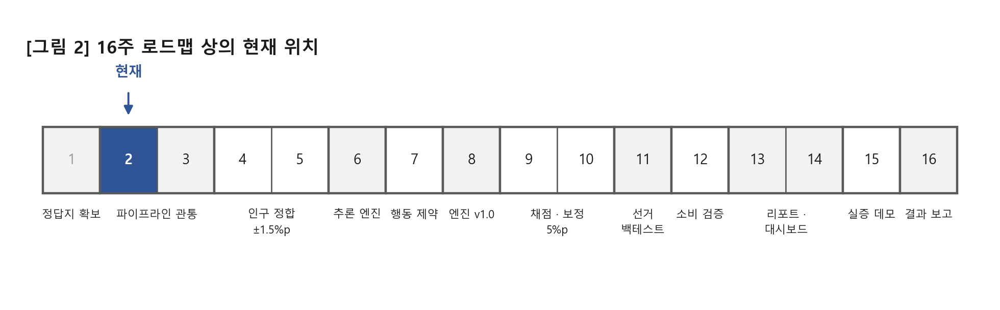
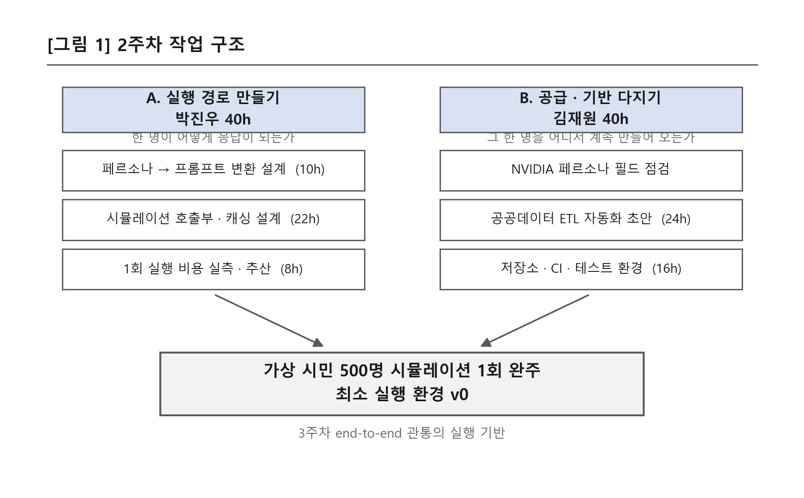
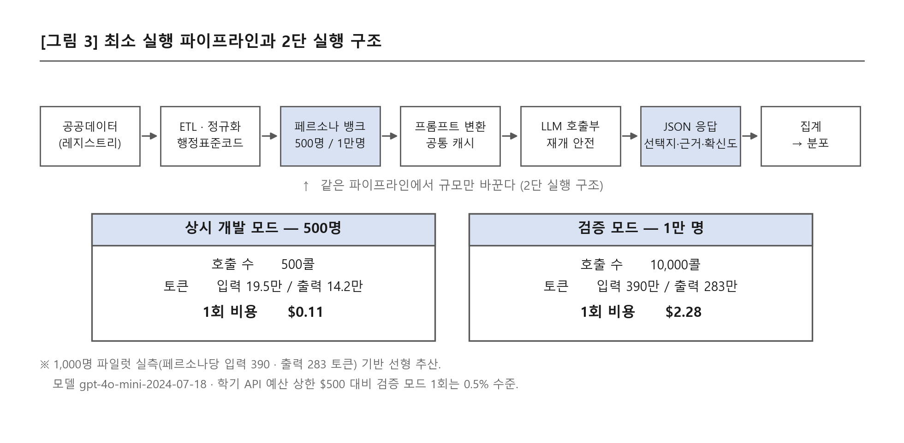

# 드림학기제 주차별 보고서 — 2주차

| 항목 | 내용 |
|---|---|
| 프로젝트명 | IDEA(이데아) — 공공데이터 기반 AI 합성 인구 행동 시뮬레이션 엔진 |
| 기간 | 2026-09-07(월) ~ 2026-09-13(일) |
| 팀원 | 박진우 40h / 김재원 40h |



---

## 1. 프로젝트 주차 목표

가상 시민 500명을 실제로 돌려보는 최소 개발 환경을 세운다.
(이번 주차엔 작은 규모라도 시뮬레이션 전체 동작 확인)

### 상세 목표

- NVIDIA 한국 페르소나 데이터셋 다운로드·적재, 실제 필드 구성 확인 (인구·지리 속성 / 행동·소비 속성 유무 점검)
- LLM API 연동 및 AWS 서버리스(Lambda 등) 기본 구조 구성
- 가상 시민 500명 축소 모드 골격 구축 — 평시엔 500명으로 싸게 돌리고, 검증 때만 1만 명을 돌리는 2단 구조의 토대
- 공통 시스템 프롬프트 캐싱 설계 + 시뮬레이션 1회 실행 비용(토큰·호출 수) 실측·추산

### 팀원별 목표 및 투입시간

| 팀원 | 목표 및 활동 | 투입시간 |
|---|---|---|
| 박진우 | 시뮬레이션 호출부·프롬프트 캐싱 설계 22h + 1회 실행 비용 추산 8h + 페르소나→프롬프트 변환 구조 설계 10h | 40h |
| 김재원 | 공공데이터 ETL 자동화 초안 24h + [독립] GitHub 저장소·CI·테스트 환경 구축 16h | 40h |

---

## 2. 프로젝트 주차 진행 내용



1주차가 "무엇을 무엇으로 채점할 것인가"를 정하는 주였다면, 이번 주는 그 채점 대상을 실제로 만들어내는 기계를 세우는 주다. 작업은 두 축으로 나누어 병렬 진행하였다.
A축은 "페르소나 한 명이 어떻게 응답이 되는가"라는 실행 경로를 만드는 쪽이고,
B축은 "그 한 명을 어디서 계속 만들어 오는가"라는 공급·기반을 다지는 쪽이다.
두 축은 주 후반에 500명 시뮬레이션 1회 완주로 합류시켰다.

### A-1. 페르소나 → 프롬프트 변환 구조 설계 (박진우 10h)

페르소나 뱅크의 구조화 레코드(성·연령·지역·학력·성향 등)를 LLM이 읽을 수 있는 자연어 프로필로 바꾸는 계층을 설계하였다. 이 계층에 세 가지 규칙을 걸었다.

| 규칙 | 내용 | 이유 |
|---|---|---|
| ① 사실 불변 렌더링만 허용 | 구조화된 값을 문장으로 바꾸기만 할 뿐, 없는 속성을 지어내지 않는다 | "취미는 등산", "성격은 외향적" 같은 속성을 AI가 만들어 붙이면 그럴듯해 보이지만, 그 속성의 실제 분포는 세상에 정답이 없어 검증이 불가능하다. 정확도를 공개하는 것이 제품인 이상, 검증할 수 없는 속성은 넣지 않는다 |
| ② x는 주고 P(y)는 주지 않는다 | 페르소나의 사실(x)과 시나리오 설명은 프롬프트에 넣되, 맞히려는 응답변수(y)의 실측 통계나 행동 지시는 넣지 않는다 | 정답을 알려주고 정답을 맞히게 하면 채점 자체가 무의미해진다 |
| ③ 지역은 행정표준코드로 다룬다 | 프로필 문장에는 지역명을 쓰되, 내부 결합은 코드로 한다 | '중구'처럼 이름이 겹치는 지역이 여럿이라 문자열 결합은 조용히 틀린다 |

**부가 설계 — 프로필 정보량 3단 모드**

무프로필 / 인구 속성만 / 풀 프로필의 3단으로 켜고 끌 수 있게 만들었다. 어느 정보가 실제로 정확도에 기여하는지를 나중에 어블레이션으로 잴 수 있어야 하며, 이 구조가 없으면 "프로필을 넣으니 좋아졌다"는 주장을 증명할 방법이 없다.

### A-2. 시뮬레이션 호출부 및 프롬프트 캐싱 설계 (박진우 24h)

**LLM API 연동**

| 구성 요소 | 내용 |
|---|---|
| 백엔드 레지스트리 | 모델·엔드포인트를 설정으로 교체할 수 있게 분리. 특정 업체에 코드가 묶이지 않도록 하기 위함 |
| 레이트 리미터 | 동시 요청·분당 요청 수 제한. 무리하게 밀어 넣으면 429(요청 초과)로 상당량이 버려진다 |
| 키 스크럽 | 로그·오류 메시지에 API 키 원문이 찍히지 않도록 마스킹 |

**컷오프 게이트 (검증 무결성 장치)**

모델의 학습 데이터 컷오프가 채점 대상 선거일보다 늦으면 그 모델은 답을 이미 알고 있는 셈이다. 이 경우 실행 자체를 막도록 어서션을 걸었고, 불가피하게 강행할 때는 결과에 `MEMORIZATION_RISK` 라벨이 자동으로 붙게 하였다.

- 사용 모델: `gpt-4o-mini-2024-07-18` (컷오프 2023-10)
- 21대 대선(2025-06)보다 컷오프가 앞서므로 채점에 사용 가능

**공통 시스템 프롬프트 캐싱 설계**

한 번 실행할 때 500~10,000개의 요청이 나가는데, 그중 시스템 프롬프트(역할 지시·출력 형식 규정)는 전원 동일하다. 이 공통부를 캐시 대상으로 분리하고, 요청마다 달라지는 것은 개인 프로필과 문항만 남기는 구조로 설계하였다. 캐시 실적용 효과 측정은 3주차 관통에서 수행한다.

**재개 안전 (resume-safe)**

완료된 요청의 키를 기록해 두어, 절전·네트워크 단절로 중단되어도 같은 명령을 다시 실행하면 남은 것부터 이어서 처리한다. 중복 저장이나 유실이 발생하지 않는다.

**생성과 채점의 분리**

LLM 원본 응답은 예외 없이 jsonl로 저장한다. 채점 방식이나 가중치를 바꾸더라도 저장된 응답 위에서 다시 계산하면 되므로, API를 한 번도 다시 부르지 않는다(0콜). 학기 후반 보정 연구가 비용 없이 반복 가능해진다.

> AWS 서버리스 기본 구조는 이번 주 도입을 보류하였다. 판단 근거는 4-① 참조.

### A-3. 1회 실행 비용 실측 및 추산 (박진우 6h)

추산이 아니라 실측부터 하였다. 1,000명 규모로 1문항을 실제로 돌려 토큰과 호출 수를 측정하고, 그 값을 선형 확장하여 500명·1만 명 비용을 산출하였다.

| 실측 항목 (1,000명 × 1문항) | 값 |
|---|---|
| 호출 수 | 1,000콜 |
| 입력 토큰 | 390,135 (페르소나당 평균 390) |
| 출력 토큰 | 282,746 (페르소나당 평균 283) |
| 비용 | $0.228 |

→ 페르소나 1인 1문항 = 약 **$0.00023**. 이 단가가 2단 실행 구조(500명 상시 / 1만 명 검증)의 근거가 된다. 상세는 3-4 참조.

### B-1. NVIDIA 한국 페르소나 데이터셋 필드 점검 (김재원)

계획대로 데이터셋을 적재하고 실제 필드 구성을 확인하였다. **점검 결과가 이후 설계를 바꾸었으므로** 결과를 그대로 기록한다.

| 속성군 | 점검 결과 |
|---|---|
| 인구·지리 속성 (성·연령·지역·학력 등) | 존재. 골격으로 사용 가능 |
| 행동·소비 속성 (동선·지출·미디어 이용 등) | **부재**하거나, 있더라도 AI가 생성한 값이라 실측과 대조할 방법이 없음 |

**판단 — 골격은 참조하되 '살'은 실측에서 가져온다**

페르소나에 개인 속성을 채워 넣을 때, AI가 만들어낸 속성을 쓰지 않고 실측 마이크로데이터(통계청·KGSS 등)에서 실제 응답자의 값을 복사해 붙이는 방식으로 확정하였다. 근거는 두 가지다.

- **검증 불가능성** — AI가 발명한 속성 조합은 실측 정답이 세상에 없어 틀렸다는 것조차 증명할 수 없다. "오차를 공개한다"는 제품 성격과 정면으로 충돌한다.
- **편향의 합성** — 속성을 만드는 AI의 고정관념이 인구에 주입되고, 응답을 만드는 AI도 같은 계열의 편향을 갖는다. 두 편향이 상쇄되지 않고 겹쳐서 커진다.

**영향** — 7주차 '행동 제약'(실제로 어디 가고 얼마 쓰는지)은 이 데이터셋으로는 구현할 수 없으며, 별도 실측 소스가 필요하다. (4-② 참조)

### B-2. 공공데이터 ETL 자동화 초안 (김재원 26h, B-1 포함)

원자료를 매번 손으로 열어 가공하는 방식은 3주 안에 무너진다. 원자료에서 페르소나 뱅크까지 한 번의 명령으로 만들어지는 경로를 구성하였다.

```
원자료(레지스트리)
  → 인코딩·컬럼 정규화(harmonize)
  → 정규 스키마 테이블
  → 페르소나 뱅크 생성(jsonl)
  → 정합 검증 리포트 자동 출력
```

**적용한 규칙**

| 규칙 | 내용 |
|---|---|
| 경로 하드코딩 금지 | 데이터 접근은 반드시 레지스트리를 경유하고, 루트 위치는 환경변수(`IDEA_DATA_DIR`)로 바꿀 수 있게 하였다. 다른 PC에서도 코드 수정 없이 동작한다 |
| 인코딩 정규화 | 공공데이터 원자료가 cp949인 경우가 많아 적재 단계에서 일괄 정규화 |
| 행정표준코드 조인 | 지역 결합은 코드 기준 (A-1 규칙 ③과 동일) |

**500명 축소 모드 골격 산출** — 위 경로로 전국 500명 / 광명 500명 뱅크를 실제로 생성하였다. LLM을 부르지 않는 구간이므로 API 0콜, 비용 $0이다. 정합 결과는 3-4 참조.

### B-3. GitHub 저장소 · CI · 테스트 환경 구축 (김재원 14h, 독립 수행)

**저장소 위생**

- `.gitignore`에 원자료 폴더(`data/raw/`)와 대형 jsonl 패턴을 등록. 수백 MB 원자료와 실험 원본이 저장소에 딸려 들어가는 사고를 차단.
- 실험 원자료는 모델별로 태그를 붙여 분리 저장. 기준선이 되는 이전 실행 결과를 덮어쓰지 못하게 하였다.

**테스트 환경**

- **골든 테스트** — 집계 결과의 전국 합계가 맞는지 등 깨지면 안 되는 값을 자동 검사.
- **API 0콜 자체검증 스크립트** — LLM을 한 번도 부르지 않고 호출부 전체를 점검한다. 컷오프 게이트 동작, 응답 파서(코드펜스 제거·결측 처리), 레이트 리미터, 키 비노출 등 **24개 항목을 검사하며 이번 주 전 항목 통과**를 확인하였다.

> 돈을 쓰지 않고 배관이 정상인지 매번 확인할 수 있다는 점이 중요하다.

---

## 3. 프로젝트 주차 진행 결과

### 3-1. 산출물 목록 (계획 대비 실적)

| 산출물 | 계획 | 결과 | 비고 |
|---|---|---|---|
| 동작하는 개발 환경 | 구축 | 완료 (로컬 러너 기준) | 서버리스는 보류 (4-①) |
| 500명 축소 모드 실행 골격 | 구축 | 완료 (전국 500 + 광명 500) | 정합 결과 3-4 |
| 1회 실행 비용 추산표 | 추산 | 완료 (추산 아닌 **실측 기반**) | $0.11 / $2.28 |
| 페르소나 데이터셋 필드 구성 확인 | 점검 | 완료 — 행동·소비 속성 부재 확인 | 설계 변경 유발 (4-②) |
| ETL 자동화 초안 | 초안 | 완료 (원자료→뱅크 1명령 경로) | |
| 저장소 · CI · 테스트 환경 | 구축 | 완료 (자체검증 24항목 통과) | |

### 3-2. 이번 주 최종 결과물 — 500명 시뮬레이션 1회 완주



이번 주의 목표는 "작은 규모라도 시뮬레이션이 한 번은 돌아가야 한다"였다. 공공데이터에서 시작해 집계된 응답 분포가 나오기까지의 전 구간을 끊김 없이 한 번 통과시켰고, 중간에 사람 손이 들어가는 구간을 남기지 않았다.

**통과한 구간**

```
공공데이터(레지스트리) → ETL·정규화 → 페르소나 뱅크 500명
  → 프롬프트 변환(공통 캐시) → LLM 호출부 → JSON 응답 → 집계·분포
```

이 파이프라인의 핵심 성질은 **규모가 파라미터**라는 점이다. 500명과 1만 명이 다른 코드가 아니라 같은 코드의 다른 인자이므로, 개발 중에는 싸게 돌리고 검증 때만 크게 돌리는 2단 운용이 가능해진다.

### 3-3. 최소 실행 환경 모듈 구성

| 모듈 | 역할 | 이번 주 상태 |
|---|---|---|
| 레지스트리 | 데이터 위치·해시·출처 관리 | 1주차 구축분 연동 |
| ETL · 정규화 | 인코딩·컬럼 조화 → 정규 스키마 | 초안 완료 |
| 페르소나 뱅크 | 정규 스키마 → 가상 시민 생성 | 500명 모드 완료 |
| 프롬프트 변환 | 레코드 → 자연어 프로필 | 3단 모드 설계 완료 |
| LLM 호출부 | API 연동·레이트리미터·재개 | 완료 |
| 컷오프 게이트 | 오염 모델 실행 차단 | 완료 |
| 응답 캐시 | 원본 jsonl 영구 저장 | 완료 |
| 채점 · 집계 | 분포 산출 | 최소 기능 |
| 자체검증 | API 0콜 배관 점검 (24항목) | 전 항목 통과 |

### 3-4. 500명 축소 모드 정합 결과 및 1회 실행 비용

**500명 뱅크의 실제 인구 대비 편차 (최대 |오차|, %p)**

| 구분 | 성별 | 연령 | 학력 | 판단 |
|---|--:|--:|--:|---|
| 전국 500 | 0.1 | 0.9 | 1.5 | 축소 모드로서 양호 |
| 광명 500 | 0.2 | **3.5** | 2.4 | 연령축 편차 큼 — n=500 표본 노이즈 |

- 500명은 개발용 축소 모드이지 정합 목표를 판정하는 규모가 아니다. 4~5주차 1만 명 규모에서 표본 노이즈가 줄면서 ±1.5%p 기준에 접근하는 것이 정상 경로이며, 광명 연령축 3.5%p는 그때 재확인한다.
- 이번 주에 확인한 것은 **"정합 로직이 동작하고 편차를 항목별로 뽑아낼 수 있다"**까지다.

**1회 실행 비용 (실측 기반)**

| 모드 | 인원 | 호출 수 | 입력 토큰 | 출력 토큰 | 비용 |
|---|---|---|---|---|--:|
| 상시 개발 모드 | 500명 | 500콜 | 19.5만 | 14.2만 | **$0.11** |
| 검증 모드 | 1만 명 | 10,000콜 | 390만 | 283만 | **$2.28** |
| *(실측 기준선)* | *1,000명* | *1,000콜* | *39.0만* | *28.3만* | *$0.228* |

- 모델: `gpt-4o-mini-2024-07-18`
- 학기 API 예산 상한 $500 대비, 검증 모드 1회 실행은 **0.5% 수준**
- 어블레이션(조건을 바꿔 3~4회 반복)도 상시 모드에서는 회당 $0.5 미만
- 운영 규칙: 풀런 발주 전 예상 비용을 문서에 먼저 기입한다

### 3-5. 이번 주 통과 여부 판정

| 판정 기준 | 결과 |
|---|---|
| ① 500명 시뮬레이션이 실제로 1회 완주했는가 | 통과 |
| ② 개발/검증 2단 구조의 토대가 마련되었는가 | 통과 (규모 = 파라미터) |
| ③ 1회 실행 비용을 수치로 답할 수 있는가 | 통과 (실측 기반) |
| ④ AWS 서버리스 기본 구조를 구성했는가 | **미충족 — 의도적 보류** (4-① 참조) |

**종합 판정** — "이번 주말엔 작은 규모라도 시뮬레이션이 한 번 돌아가야 한다"는 이번 주의 통과 조건은 충족하였다. 서버리스 구조는 계획서 항목이지만 현 단계에서 편익보다 비용이 크다고 판단하여 의도적으로 보류하였으며, 이는 계획 미달이 아니라 우선순위 조정임을 4-①에 근거와 함께 기록한다.
→ **통과. 3주차 end-to-end 관통 착수에 지장 없음.**

### 3-6. 투입시간 실적

| 팀원 | 항목 | 계획 | 실제 | 차이 사유 |
|---|---|--:|--:|---|
| 박진우 | 시뮬레이션 호출부·캐싱 설계 | 22h | 24h | 재개 안전·응답 캐시 계층 추가 |
| | 1회 실행 비용 추산 | 8h | 6h | 실측이 있어 조기 확정 |
| | 페르소나→프롬프트 변환 설계 | 10h | 10h | |
| | **소계** | **40h** | **40h** | |
| 김재원 | 공공데이터 ETL 자동화 초안 | 24h | 26h | 데이터셋 필드 점검 포함 |
| | 저장소·CI·테스트 환경 구축 | 16h | 14h | |
| | **소계** | **40h** | **40h** | |
| | **합계** | **80h** | **80h** | |

### 3-7. 다음 주차 이월 항목

| 이월 항목 | 처리 시점 | 담당 |
|---|---|---|
| 프롬프트 캐싱 실적용 효과 측정 | 3주차 | 박진우 |
| AWS 서버리스 전환 | 14주차 (대시보드 시) | 김재원 |
| 행동·소비 실측 소스 확보 | 7주차 이전 | 김재원 |
| 1만 명 규모 정합 재확인 | 4~5주차 | 김재원 |
| MDIS 승인 대기 *(1주차 이월)* | 승인 시 | 김재원 |
| 경기 카드매출 대체 소싱 *(1주차 이월)* | 상시 | 김재원 |

---

## 4. 기타 (문제점, 해결방법, 자기평가)

### ① 판단 — AWS 서버리스 구조 도입 보류

| 구분 | 내용 |
|---|---|
| 현상 | 계획서 2주차 항목에 "LLM API 연동 및 AWS 서버리스(Lambda 등) 기본 구조 구성"이 있으나, 이번 주에는 도입하지 않았다. |

**판단 근거**

1. 이 프로젝트의 실행은 하루 수 회의 배치 작업이지 상시 트래픽이 아니다. 서버리스의 이점(요청량에 따른 자동 확장)이 발생할 조건이 없다.
2. 1만 명 실행도 로컬 러너로 처리 가능한 규모임을 이번 주 비용·토큰 실측으로 확인하였다.
3. 지금 서버리스로 감싸면 배포·권한·모니터링에 시간이 들어가는데, 그 시간은 3~5주차 인구 정합과 6주차 추론 엔진에 쓰는 편이 학기 성과에 직결된다.

**해결방법** — 서버리스 전환은 외부 사용자가 접속하는 시점, 즉 14주차 자연어 대시보드 구축과 묶어 처리한다. 지금은 호출부를 백엔드 교체가 가능한 구조로 분리해 두어, 그때 전환 비용이 크지 않도록 하였다. 보류 사실과 사유를 결과보고서에도 그대로 남긴다.

### ② 문제점 — 페르소나 데이터셋에 행동·소비 속성 부재

| 구분 | 내용 |
|---|---|
| 현상 | NVIDIA 한국 페르소나 데이터셋에는 인구·지리 속성만 있고, 7주차에 필요한 행동·소비 속성이 없다. 있더라도 AI 생성값이라 실측 대조가 불가능하다. |
| 영향 | 7주차 '행동 제약' 단계의 데이터 공급원이 비어 있다. 1주차에 확인한 경기 카드매출 미확보와 합쳐지면 소비축 전체가 흔들린다. |

**해결방법**

1. 페르소나의 개인 속성은 실측 마이크로데이터에서 복사해 붙이는 방식으로 원칙을 확정하였다(B-1). 이 원칙 아래에서는 필요한 도메인이 열릴 때 해당 도메인의 실측 조사를 모듈로 붙이면 된다.
2. 행동·소비 축의 실측 후보(생활시간조사·미디어패널조사 등)를 7주차 이전에 접근 가능성·라이선스 기준으로 조사한다.
3. 확보하지 못할 경우 7주차 범위를 조정하고, 그 사실을 은폐하지 않는다.

### ③ 문제점 — 외부 모델 의존에 따른 재현성 리스크

| 구분 | 내용 |
|---|---|
| 현상 | 우리가 쓰는 모델은 외부 업체가 운영하며, 특정 스냅샷이 예고 없이 은퇴(EOL)될 수 있다. 그러면 같은 명령을 실행해도 같은 결과가 나오지 않아, 학기 후반의 재현성 주장이 무너진다. |

**해결방법**

1. 모델 스냅샷 버전(`gpt-4o-mini-2024-07-18`)을 실행 기록에 항상 남긴다. `gpt-4o-mini`처럼 버전 없는 표기는 쓰지 않는다.
2. 원본 응답을 jsonl로 영구 보관한다. 모델이 사라져도 저장된 응답으로 재채점이 가능하므로, 결과의 재현은 모델 생존과 무관해진다.
3. 대체 모델은 컷오프가 채점 대상 선거일보다 앞선 것만 후보로 둔다.

### 자기평가

**잘한 점**

- "이번 주말엔 작은 규모라도 한 번 돌아가야 한다"는 계획서의 조건을 문자 그대로 지켰다. 완성도를 높이는 대신 **끝까지 한 번 통과시키는 쪽**을 택한 것이 맞았다고 본다. 막힌 구간이 어디인지를 추측이 아니라 실행으로 알게 되었다.
- 비용을 추산이 아니라 **실측**으로 잡았다. 1인 1문항 $0.00023이라는 단가가 나오자 2단 실행 구조의 규모(500 / 1만)가 감이 아니라 계산으로 정해졌고, 학기 예산 안에서 몇 번을 돌릴 수 있는지도 명확해졌다.
- 데이터셋 필드 점검이 단순 확인 작업으로 끝나지 않고 **설계 원칙(살은 실측에서만)**으로 이어졌다. 계획서가 "유무 점검"을 시킨 이유가 여기 있었다고 본다.

**아쉬운 점**

- 프롬프트 캐싱은 설계만 했고 실제 절감 효과는 재지 못했다. 3주차 관통에서 캐시 적용 전후 토큰을 비교해 수치로 남길 필요가 있다.
- 광명 500명 뱅크의 연령축 편차가 3.5%p로 컸다. 표본 크기 때문이라고 판단하고 있으나, 1만 명에서도 줄지 않으면 로직 문제이므로 4~5주차에 반드시 확인해야 한다. **지금 시점에서는 "확인 예정"일 뿐 해결된 것이 아니다.**

**다음 주 초점**

3주차 목표대로 '1개 행정동 × 가상 시민 100명 × 질문 1개'로 전체 흐름을 end-to-end 한 번 관통시키고, 출력 JSON 표준 스키마를 확정한다. 이번 주에 세운 배관 위에서 실제 데이터 한 조각을 끝까지 흘려보내는 것이 목표다.
